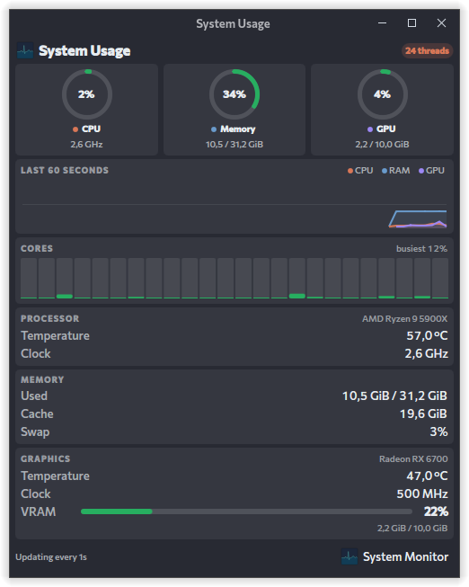
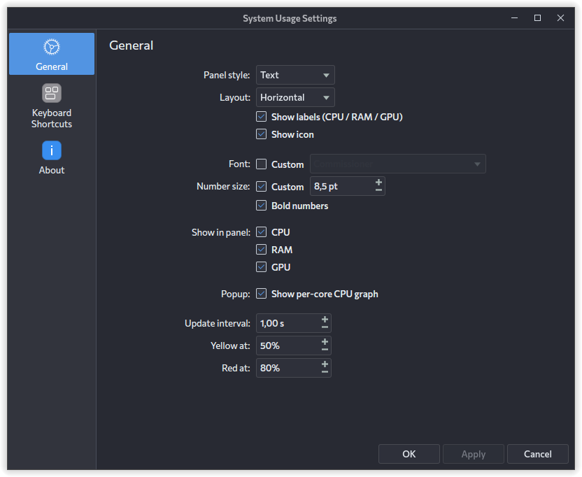

# System Usage

A KDE Plasma 6 panel widget that shows CPU, RAM and GPU usage as color-coded rings, styled after the Claude Usage widget.



## Features

- **Panel:** a ring, bar or text readout per metric, green → yellow → red at configurable thresholds (50% / 80% by default). Left-click opens the popup, middle-click opens System Monitor.
- **Popup:** usage rings, a 60-sample trend chart, an optional per-core CPU bar graph, and detail cards for the processor (model, temperature, clock), memory (used, cache, swap) and graphics (model, temperature, clock, power, VRAM).
- **Settings:** panel style and layout, which metrics to show, labels, icon, the per-core graph, update interval, color thresholds, and the panel font family, size and weight.



Data comes from KDE's `ksystemstats` daemon (the same source as System Monitor), so nothing is polled with shell commands. The CPU model name is read once from `/proc/cpuinfo`.

## Install

```sh
kpackagetool6 -t Plasma/Applet -i package
```

Update after making changes:

```sh
kpackagetool6 -t Plasma/Applet -u package
plasmashell --replace &
```

Then right-click the panel → **Add Widgets** → search for **System Usage**.

Run it in a window for testing:

```sh
plasmawindowed org.kde.plasma.systemusage
```

## Requirements

- Plasma 6
- `ksystemstats` (ships with Plasma) — GPU stats depend on its GPU plugin supporting your card (tested on AMD; NVIDIA needs `nvidia-smi`)

## License

GPL-3.0-or-later. `UsageRing.qml` and `TrendChart.qml` are adapted from the Claude Usage plasmoid by izll and Hody (GPL-3.0-or-later).
